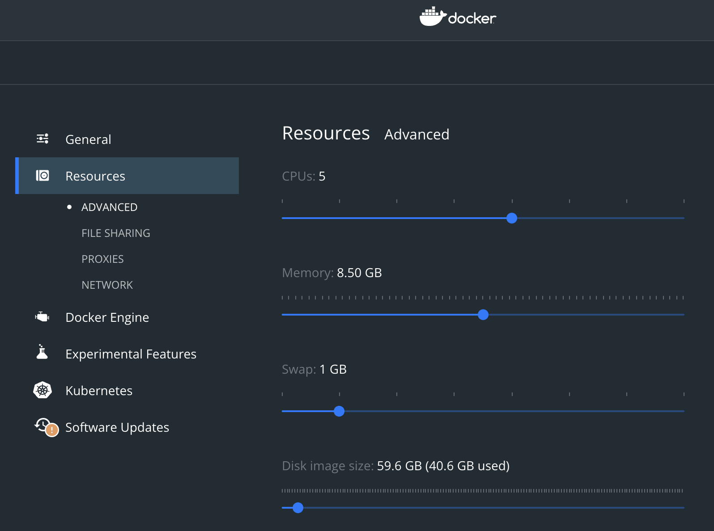

# Hospitalization prediction for elderly population

## Description

The project aims to predict the probability of hospitalization for elderly Mexican individuals using machine learning algorithms and data such as demographics, health indicators, and medical history. The model can help healthcare providers identify high-risk patients and allocate resources accordingly.

## Training

### 1. Prepare our dataset and train the model

#### 1.1. Make sure your local docker engine has the minimum available resources to process the data and train the model

**Memory:** 6-8GB minimum



#### 1.2. Go to folder model_engineering

```bash
$ cd model_engineering
```

#### 1.3. Run the docker-compose.yml to download the dataset, preprocess the data and finally to get the trained model, the pipeline for preprocessing and the 50 most important features that will be used to predict

```bash
$ docker-compose up --build -d
```

After running the train model container the output will be:

- `model_engineering/dataset/H_MHAS_c2.sas7bdat`: Original dataset.
- `model_engineering/dataset/application_train_aai.csv`: Processed dataset (ready for training).
- `services/common/features/top50_features.txt`: List of the 50 most important features from teh dataset.
- `services/model_service/trained_model/final_model.pkl`: Trained model.
- `services/model_service/trained_model/preprocessing_pipeline.pkl`: Pipeline for preprocessing.

## Prediction

**IMPORTANT: You have to train and generate the output files first before running the prediction services.**

#### 2.1. Go to folder services

```bash
$ cd services
```

#### 1.3. Run the docker-compose.yml to start running the model_service, view_service and redis instance

```bash
$ docker-compose up --build -d
```

## Prediction Architecture


